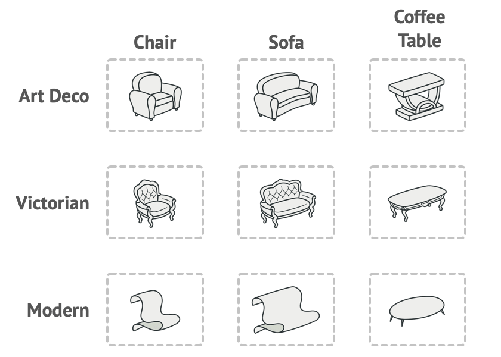
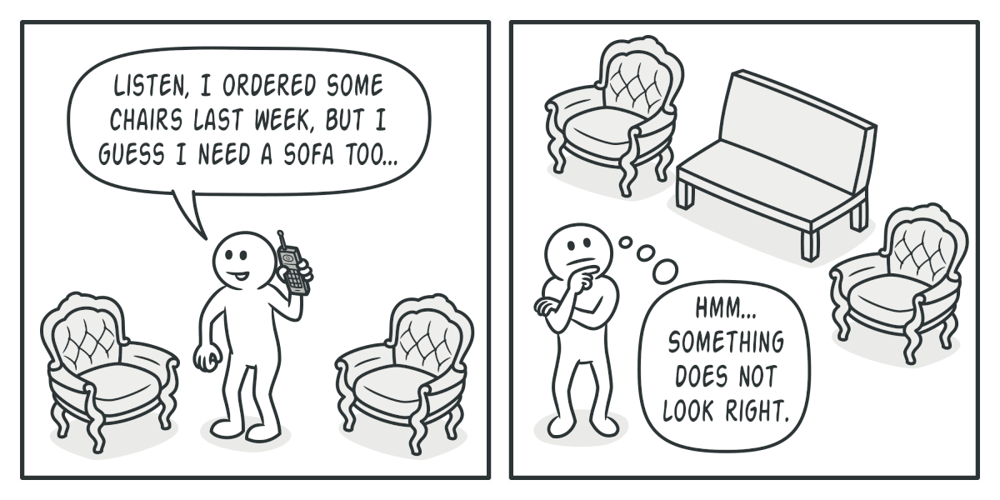
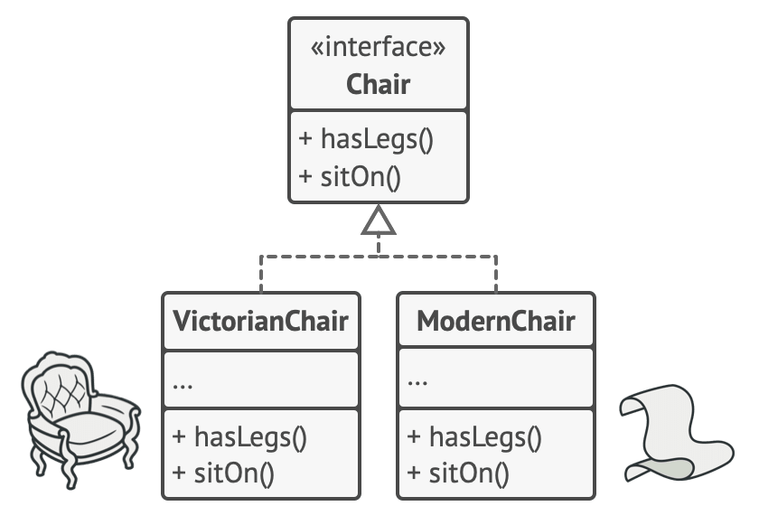
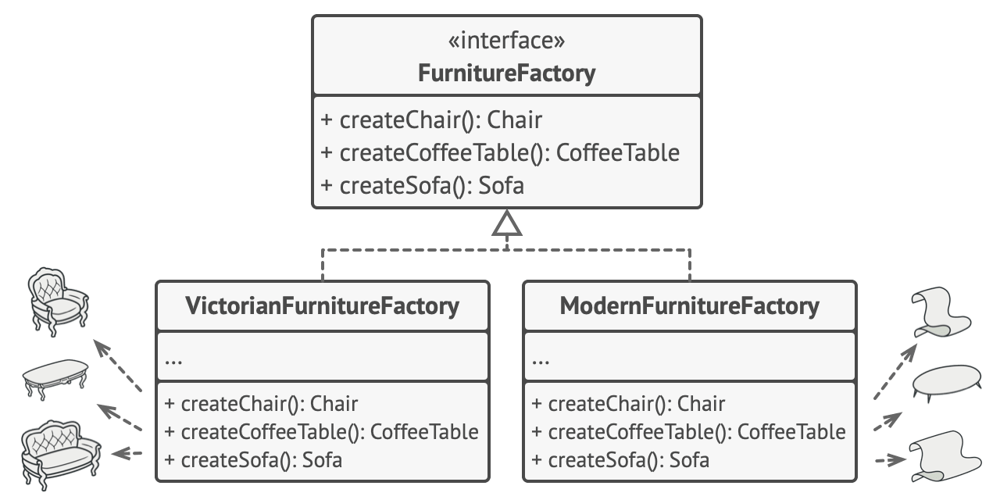

# Abstract Factory Pattern

## How it is different from `Factory Method Pattern`

### Factory Method Pattern

> Defer conditional instantiation to subclasses by defining interface

### Abstract Factory Pattern

> Put correlated classes into `Factory Class`, then define a Factory that instantiates conditionally

That is to say, an encapsulated `Factory Method Pattern`

# 의도

구체적인 클래스를 특정하지 않고 관련된 객체의 `Family`를 생성할 수 있음

# 문제

가구점 시뮬레이터를 만든다.
관련된 상품 `Family`는 `의자`+`소파`+`커피테이블`로 이루어져 있다. 
그리고 다양한 `Family`가 존재한다: `Modern`, `Victorian`, `ArtDeco`

한 `Family` 안의 가구들을 같은 양식으로 생성할 방법이 필요하다.
 
가구를 주문했는데 서로 양식이 다르다면 고객은 아마 기분이 별로일 것이다.

# 해결 방법

1. _상품 인터페이스_ 를 정의한다 
   e.g. `Chair`, `Sofa`, `CoffeeTable`
   

2. _Abstract Factory_ 를 정의한다. 
   이 인터페이스는 생성 메서드를 포함한다. 
   (e.g. `createChair`, `createSofa`, `createCoffeeTable`) 
   이 메서드들은 직전에 정의한 _상품 인터페이스_ 를 반환해야 한다.

3. _Abstract Factory_ 를 기반으로 각각의 _Factory_ 를 생성한다. 
   `ModernFurnitureFactory`는 `ModernChair`, `ModernSofa`, `ModernCoffeeTable` 만 생성할 것이다. 
   

# 정리
클라이언트가 의자를 주문한다고 하자. 
_Abstract Factory_ 를 사용하면 클라이언트는 의자의 구체적인 객체를 알 필요가 없다.(**투명성**) 

`Chair` 인터페이스로 소통하기 때문에 어떤 방식으로든 `sitOn` 메서드가 구현된 것만을 알고 있다. 
또한 같은 공장에서 주문한 의자는 해당 공장에서 주문한 다른 상품들과 양식이 같을 것이다.

# 참고
- 이해를 돕기 위한 의역이 있을 수 있다
- [Refactoring Guru - Abstract Factory](https://refactoring.guru/design-patterns/abstract-factory)
