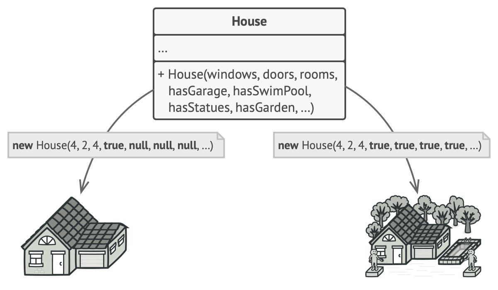
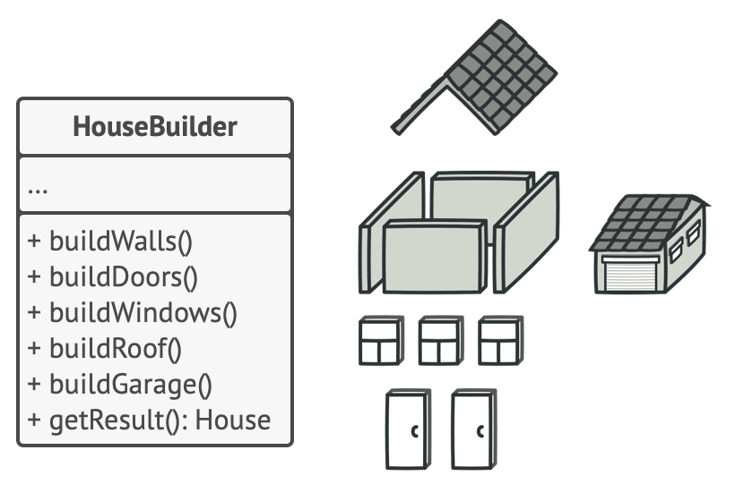
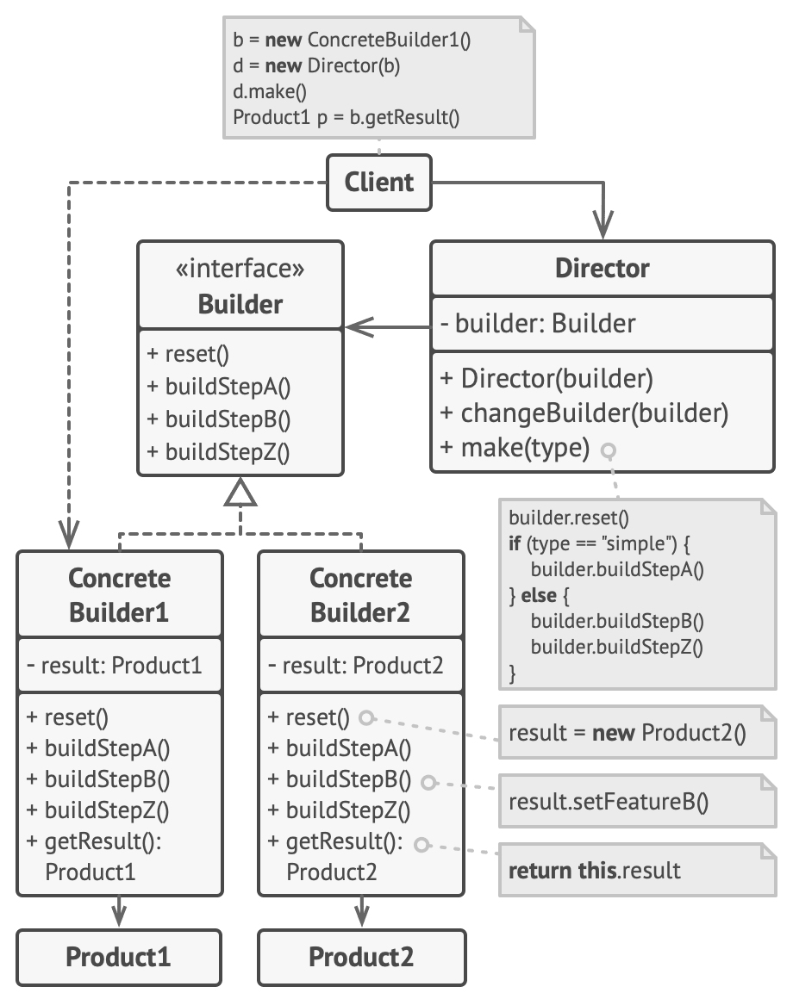
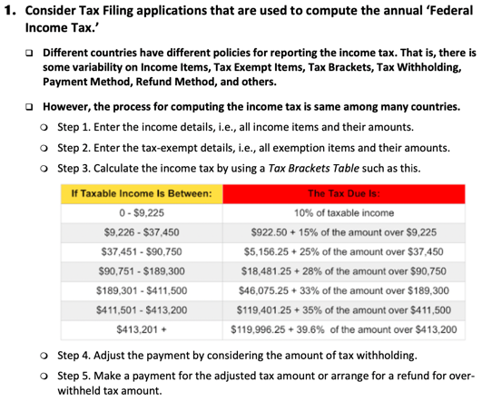
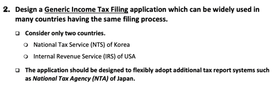

# Builder Pattern
A creational design pattern that helps you construct complex objects **step by step**.  
It helps you to produce **different types and representations** of an object with consistent code.

# 언제 쓸까?
### Telescoping Constructor(점층적 생성자) 제거
```java
class Pizza {
  Pizza(int size) { ... }
  Pizza(int size, boolean cheese) { ... }
  Pizza(int size, boolean cheese, boolean pepperoni) { ... }
  // ...
}
```
이런 코드가 있다. 아마 바로 개선 방법이 떠오를 것이다.  
별로 좋아보이지는 않는다.
이 경우에 빌더 패턴을 적용할 수 있다.  
물론 다른 생성자 패턴을 사용할 수도 있다.

### 객체의 다양한 표현을 생성하게 하고 싶을 때
집 -> 나무집, 벽돌집 등등.. 
이건 아래에서 설명할 예정이다.

### 

# 문제
많은 필드와 중첩 클래스를 가지며, 단계적인 초기화가 필요한 복잡한 코드를 상상해보자.  
아마 그 생성자는 parameter 가 엄청 많을 것이다.  
혹은 더 안좋은 경우 전체 코드에 흩어져 있을 수도 있다.

`House` 객체를 만들어야 한다면?  
집을 만드려면 벽, 바닥, 창문, 문, 지붕 등을 만들어야 한다.  
여기에 다른 요소들 (마당, 담, 수영장)도 추가하려면?  

1. `House` 클래스를 상속하는 sub-class를 만들어서 해결하는 방법  
- sub-class가 상당히 많이 생긴다 (경우의 수에 따름)

2. 엄청 큰 생성자를 만들고 다 때려 박기
- 없는 parameter들은 `null`로 넣는다
- 이건 잠깐 생각해봐도 토 나오는 방법
  - 수영장이 없으면 맨날 `null`을 넣어줘야 한다 🥲
  


# 해결
## 빌더 패턴
생성 코드를 객체 밖으로 빼서 _builder_ 라는 별도의 인터페이스로 만든다.  
`House` 객체의 경우에는 `HouseBuilder` 인터페이스를 만들게 된다.


객체 생성을 **생성 절차**들의 집합으로 정리해준다.
- buildWalls(), buildDoors() 등은 생성 절차들!  

객체 생성을 위해서는 이 메서드들을 실행해주기만 하면 된다.  
중요한 점은 모든 메서드를 실행할 필요가 없다는 것이다.   
차고가 없는 집이라면, buildGarage()는 생략할 수도 있다는 뜻이다. 상당히 우아하지 않은가😀

이제 다양한 집을 만들기 위해 구현 방법이 다른 여러 `Builder`를 추가할 수 있다.

## 구조

앞서 알게 된 내용들이 반영된 구조이다.  
처음보는 부분이 있다! `Director`?

### Director
일련의 빌드 절차를 별도의 클래스로 만들어 놓은 것이다.  
어떤 절차로 객체를 만들어야 할지 명시한다.  
물론 그 절차의 실제 구현은 `Builder`가 담당한다.

`Director`는 필수는 아니다.  
클라이언트 코드에서 `Builder`를 바로 활용할 수도 있지만, `Director`를 사용함으로서 재사용성을 올릴 수 있다.  
이렇게 되면 클라이언트 코드 측에 `Builder` 사용의 디테일을 숨길 수 있다. (은닉성)

## 예제
**Tax Filing Application**을 만들어보자  


**Tax Filing** 은 일반적으로 이런 절차를 가지고 있다.



한국, 미국에 모두 대응할 수 있는 **Tax Filing Application**을 만들어보자
