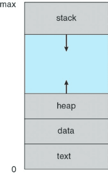

# Singleton Pattern

> 어떤 클래스가 **하나의 인스턴스**만을 가지게 하고, **Global한 접근**을 보장하게 하는 생성자 패턴

단일 책임 원칙(SRP)를 위반하여 다음 문제를 동시에 해결한다:

- 유일한 인스턴스임을 보장
- 전역 접근(**Global한 접근**) 제공
    - 이 점으로 인해 여러 클래스와 결합도가 증가해서 **단일 책임 원칙**을 위반하게 된다.

# in JAVA

## 접근

`new`를 사용하면 구조적으로 새로운 인스턴스가 만들어 질 수 밖에 없다.  
따라서 `new` 가 아닌 어떤 방법을 사용해야 한다.

- 우선 `private` 생성자를 만들어서 `new` 키워드의 사용을 의도적으로 막는다.
  
    - 프로세스 메모리 구조다. 많이 본 그림이다.
    - `new` 키워드는 동적 할당 영역인 Heap에 공간을 할당받고, 그 참조값을 리턴하며, 생성자를 호출한다.
    - `new` 키워드를 사용하는 순간 메모리의 할당은 피할 수 없다.


- `static` 키워드를 사용해 **Global한 접근**을 보장해준다.

```java
public class SomeClass {

	private SomeClass() {
	}

	public static SomeClass getInstance() {
		// ...
	}
}
```

- 이 클래스의 인스턴스가 하나가 되도록 보장한다.  
  `static`을 활용한다.

```java
public class SomeClass {

	private static final SomeClass instance;

	private SomeClass() {
	}

	public static SomeClass getInstance() {
		if (instance == null)
			instance = new SomeClass();
		return instance;
	}
}
```

## 해치웠나?

방금 이 말을 해서 세계가 변했다.  
당신은 이제 _멀티스레딩_ 이 존재하는 다른 세계로 와버렸다.  
이제부터 저 방법으로는 **인스턴스가 하나**임을 보장할 수 없다.

멀티스레드 환경에서는 `if (instance == null)` 에 대한 평가가 동시에 발생할 수 있다.  
그렇다면 그 다음 구문이 실행되어 **인스턴스도 여러 개**가 될것이다.  
이걸 해결하려면? 원천 차단하거나, 동기화 방법이 필요하다.

- 이른 초기화 (Early Initialization)
    - 클래스 로딩 시에 객체를 생성한다.
    - 실제로 사용하기도 전에 생성하게 된다.
        - (객체 생성시점과 사용시점의 차이가 클 수 있음  
          -> 사용하지 않지만 GC도 되지 않으며, 메모리에 상주한다)
            - Lazy Initialization에 비해 조금은 더 손해가 있겠다
            - 메모리 피크에는 차이가 없을 듯

```java
public class SomeClass {

	private static final SomeClass instance = new SomeClass();

	private SomeClass() {
	}

	public static SomeClass getInstance() {
		return instance;
	}
}
```

- `syncronized` 키워드
    - 메서드를 `syncronized` 메서드로 만들기
    - 사용할 때 마다 락이 걸리므로 멀티스레딩의 장점이 사라진다.(병목)
    - _double checked locking_ 으로 개선해 볼 수 있다.

```java
public class SomeClass {

	private static final SomeClass instance;

	private SomeClass() {
	}

	// 메소드 사용 시점마다 락이 걸림(한 번에 한 쓰레드만 리소스 접근 가능)
	public static synchronized SomeClass getInstance() {
		if (instance == null)
			instance = new SomeClass();
		return instance;
	}
}
```

_double checked locking_  
성능이 개선됐다. 그러나 코드 복잡도가 조금 증가했다.

```java
public class SomeClass {

	private static final SomeClass instance;

	private SomeClass() {
	}

	// 생성 이후부터는 락이 걸리지 않음
	public static SomeClass getInstance() {
		if (instance == null) {
			synchronized (SomeClass.class) {
				if (instance == null) {
					instance = new SomeClass();
				}
			}
		}
		return instance;
	}
}
```

- `Holder`를 사용한 Lazy Initialization
    - `private` Nested Class 인 `Holder`를 사용한다.
    - 클래스 로드 시점에 초기화된다.
        - JVM의 `Class Loader`는 필요할 때 까지 클래스를 로드하지 않는다.
            - 여기서 `로드 != 객체 초기화`
        - `SomeClass`가 로드되는 시점이 되어서야 이 클래스가 참조하는 `SomeClassHolder`를 로드한다.
        - `final` 키워드로 객체가 한번만 할당되도록 한다.
        - [참고](https://stackoverflow.com/questions/24538509/does-the-java-classloader-load-inner-classes)
    - 개인적으로 이 방법이 마음에 든다. 꽤나 우아한듯?😎

```java
public class SomeClass {

	private SomeClass() {
	}

	private static class SomeClassHolder {
		private static final SomeClass instance = new SomeClass();
	}

	public static SomeClass getInstance() {
		return SomeClassHolder.instance;
	}
}
```

- Enum의 사용

- 고장내는 방법