# 데코레이터 패턴

## 기존 클래스 코드를 바꾸지 않고도 실행 중에 클래스를 꾸밀 수 있다

## 초대형 커피 전문점

### 접근 1. 상속

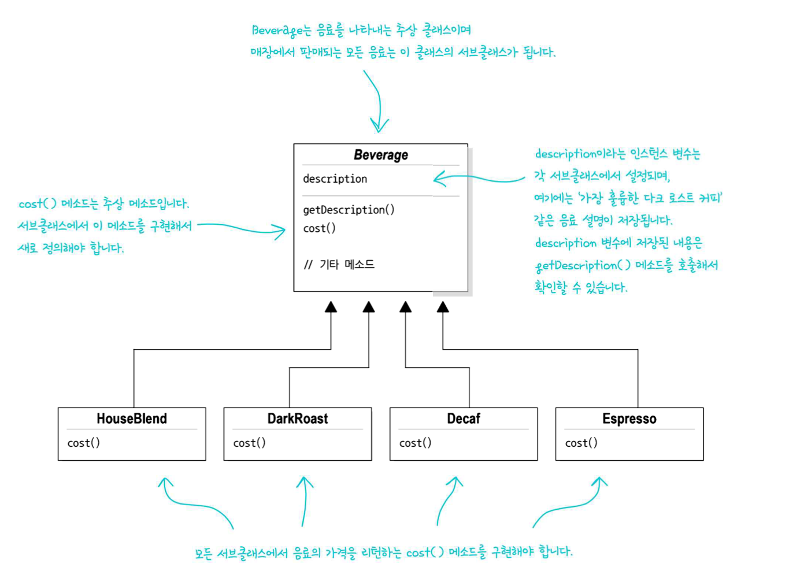

음료들은 class `Beverage`를 상속한다.

옵션을 추가하는 경우도 있으므로 다음과 같이 만들었다고 한다...
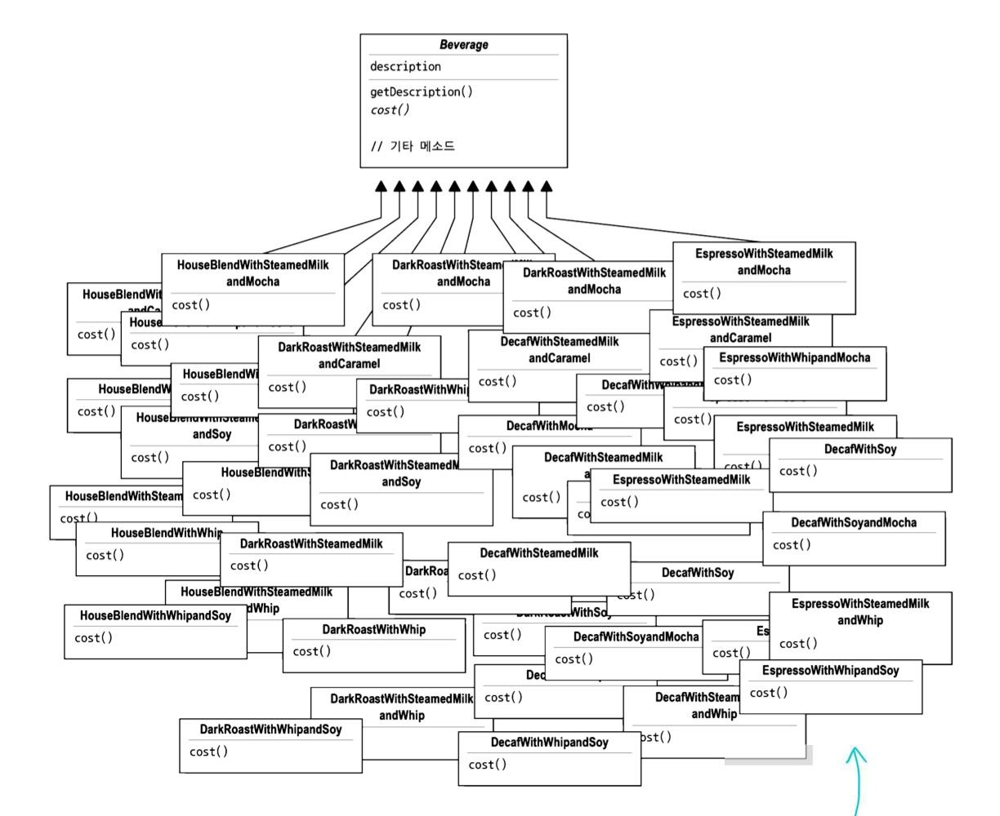

### 문제점

1. OCP, 클래스는 확장에는 열려 있어야 하지만 변경에는 닫혀 있어야 한다.

   > 달라지는 부분을 다른 코드에 영향을 주지 않도록 캡슐화 한다.

   현재 다이어그램은 이 부분이 전혀 되어있지 않다.

2. 상속보다는 구성(Composition)을 사용한다.

이런 디자인 원칙들을 지키지 못해서 이런 class diagram을 보고 있다.  
이런 디자인을 가진 프로그램에서 _우유_ 의 값이 값이 바뀐다면? _DarkRoast_ 의 값이 바뀐다면?
> 해당 이름이 들어간 모든 음료의 `cost()`를 수정해야 한다.

### 나중에 어떻게 변화할까?

어떻게 변화할지 생각해보면 해결 방법이 나올지도 모른다.
> 주로 새로운 재료가 추가되거나, 재료의 값이 바뀔 것 같다.

### 접근 2. 슈퍼클래스에서 재료를 관리

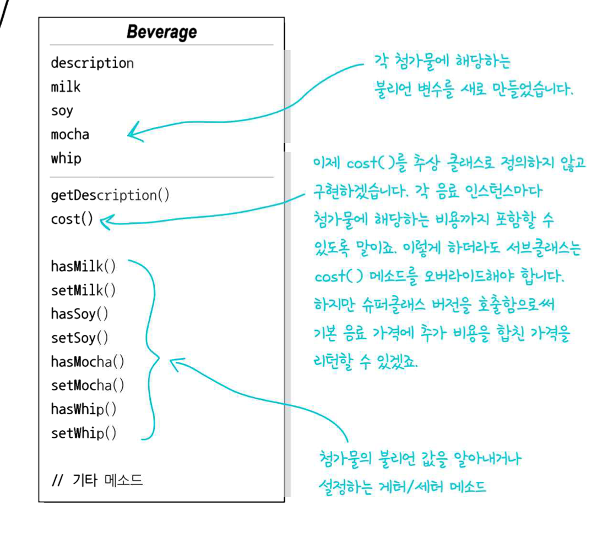

- `cost()`

```java
public class Beverage {
	String description;
	boolean milk;
	boolean soy;
	boolean mocha;
	boolean whip;

	public double cost() {
		double total = 0;
		if (hasMilk())
			total += 1000;
		if (hasSoy())
			total += 2000;
		// ...
		return total;
	}

	private boolean hasMilk() {
		return milk;
	}

	private boolean hasSoy() {
		return soy;
	}

	// ...
}

public class DarkRoast extends Beverage {

	public DarkRoast() {
		this.description = "개꿀맛 다크 로스트 커피";
	}

	@Override
	public double cost() {
		return super.cost() + 123; // 재료 + 다크 로스트 커피 추가금
	}
}
```

### 문제점

- 첨가물 가격이 바뀌면 기존 코드(`Beverage::cost`)를 수정해야 한다.
- 고객이 더블샷 모카를 주문하면..? (불가능)
- 들어가면 안되는 첨가물도 있을 수 있다. (차에 휘핑크림이?)
- 새로운 첨가물이 생기면 변수, 메서드를 추가하고 `Beverage::cost`를 고쳐야 한다.
- 그래도 기존보다는 나은 코드인듯

### 목표

기존 코드를 건드리지 않고 확장으로 새로운 행동을 추가한다.

## 데코레이터 패턴

접근 1은 클래스가 엄청 많아지는 문제, 접근 2는 오리 시뮬처럼 적합하지 않은 기능을 추가해야 하는 문제가 있다.

### 방법

음료에서 시작해서 그 위에 모카, 휘핑 등 첨가물을 _장식_ 하는 방법은 어떤가?
고객이 모카와 휘핑크림을 추가한 다크 로스트 커피를 주문했다.

1. `DarkRoast` 객체를 가져온다
2. `Mocha` 객체로 장식한다.
3. `Whip` 객체로 장식한다.
4. `cost()` 호출
    - 이때 첨가물의 가격을 계산하는 일은 해당 객체에게 위임한다.
    - 그래야 `Whip`의 가격을 바꾸기 위해 `Whip`만 수정할 수 있겠지.

### 적용

1. `DarkRoast` 객체에서 시작한다.
   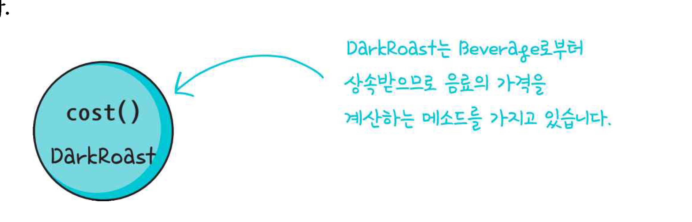
2. 모카 객체를 만들고 그것으로 `DarkRoast`를 감싼다.
   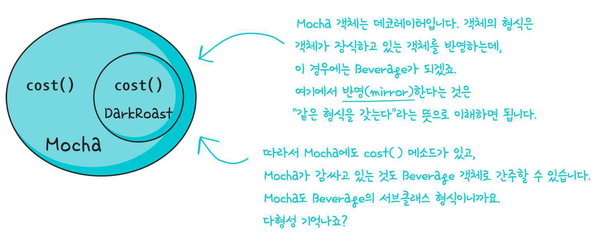
3. `Whip` 객체를 만들고, 그것으로 `Mocha` 객체를 감싼다.
   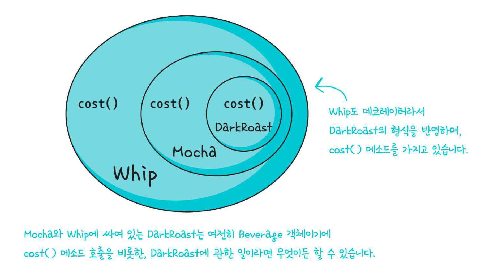
4. 가격을 계산해보자.
   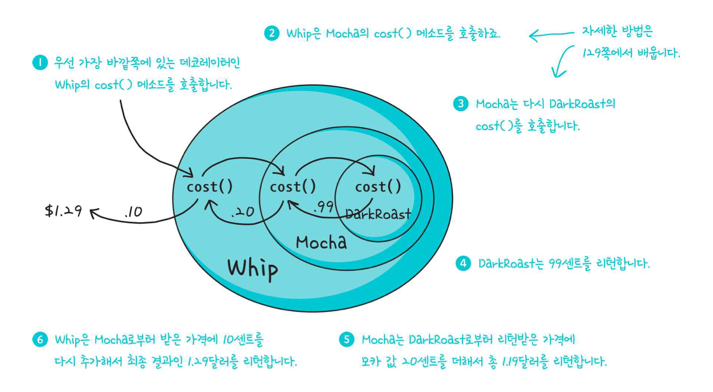
   재귀적으로 가능하게 된다.

이런 일을 하려면 연쇄적으로 감쌀 수 있는 공통적인 클래스가 있어야 하겠다.  
= `Decorator`?

### 정리

- 데코레이터의 슈퍼클래스는 자신이 장식하고 있는 객체의 슈퍼클래스와 같다.
    - `Whip` 등 `Decorator`의 슈퍼클래스는 `Beverage`
    - 그래야 장식물의 종류가 한정될 것 같다. (내 생각)
        - 음료수(슈퍼클래스가 Beverage)에는 음료수의 첨가물만 넣어야 한다! (내 생각)
        - 이걸 실현시켜 주는 것이 형식을 맞추기 위한 상속이다!
- 객체를 여러 개의 데코레이터로 감쌀 수 있다.
- 데코레이터는 자신이 장식하고 있는 객체에게 어떤 **행동**을 위임하는 일 말고도 추가 작업을 할 수 있다.
    - 예를 들어 삼겹살이면 굽는 행동으로 무게가 물어들게 될 수도 있겠지(내 생각)
- 런타임에 필요한 데코레이터를 마음대로 적용할 수 있다.

### 정의

**데코레이터 패턴**으로 객체에 추가 요소를 동적으로 더할 수 있다.  
데코레이터를 사용하면 서브클래스를 만들 때보다 훨씬 유연하게 기능을 확장할 수 있다.

### Class Diagram

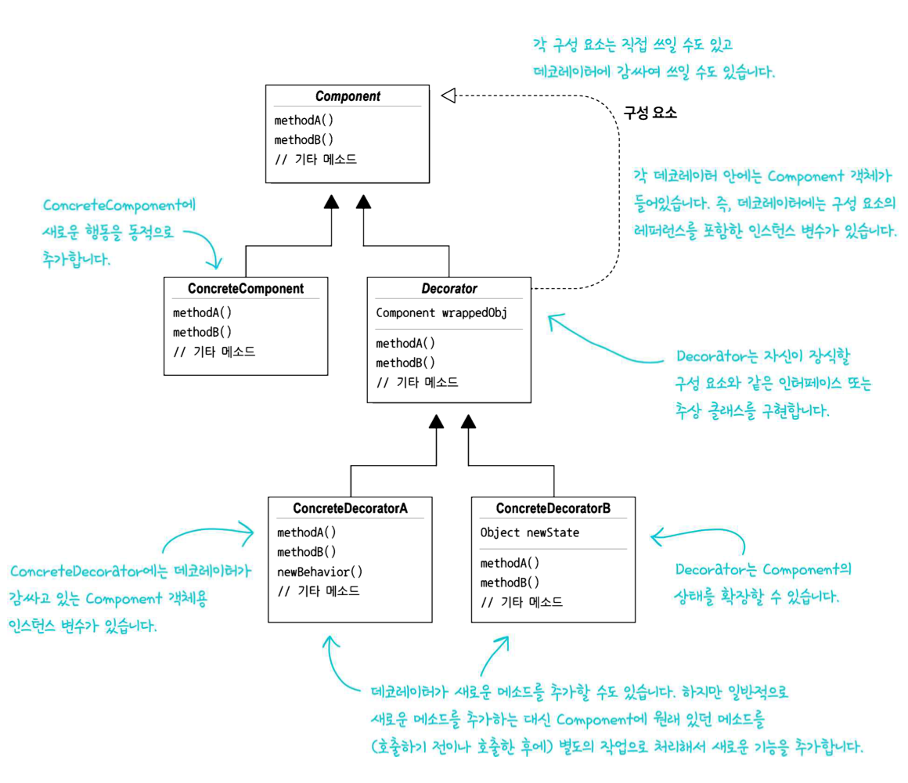

### Beverage Class Diagram

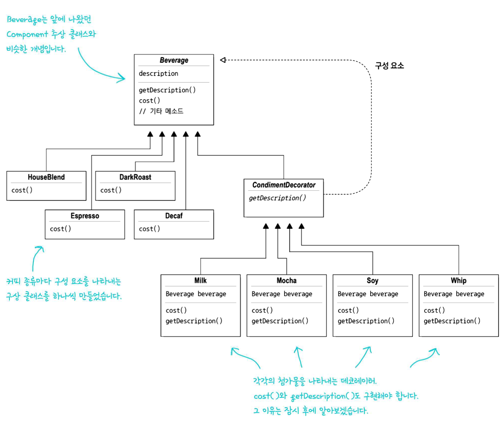

### 상속이 🐶 많은데요?

상속이 별로라고 해놓고 상속이 엄청 많다.

#### 뭐가 다른 거지?

다른 점은 **행동을 물려받기 위한** 상속이 아닌 **형식을 맞추기 위한** 상속이라는 점이다.    
**데코레이터 클래스의 형식**이 **감싸는 객체의 형식**과 같다는 점을 통해서 서로 감쌀 수 있게 되며, Beverage에 한정된다.  
(Beverage에는 Beverage의 첨가물만 넣게 된다)

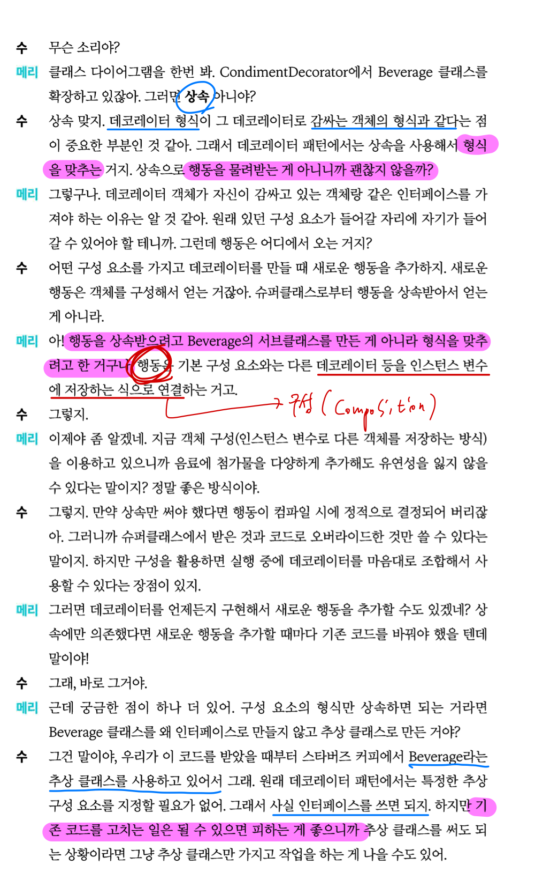

#### 왜 상속이 나쁜가?

참고

- [상속이 나쁜가?](https://programmer-ririhan.tistory.com/408)
- [상속보단 합성](https://incheol-jung.gitbook.io/docs/q-and-a/architecture/undefined-2)
- ⚠️ [Why extends is evil](https://www.infoworld.com/article/2073649/why-extends-is-evil.html)
- ⚠️ [Inheritance is procedural technique for code reuse](https://www.yegor256.com/2016/09/13/inheritance-is-procedural.html)
- [상속보단 조합](https://tecoble.techcourse.co.kr/post/2020-05-18-inheritance-vs-composition/)
- [Effective Java Item 37](https://www.ikpil.com/904)

이건 별도의 블로그 글로 정리해야겠다.
몇 가지만 정리해보자면,

1. 많은 하위 클래스, 그리고 그 관리
2. 모든 오버라이딩의 관리
    - 이 경우 상위 클래스의 메서드가 바뀌면? 하위 클래스는 오동작하게 될 수 있다.

등등 변경에 유연하지 못한 디자인이 발생하게 된다.

내 생각에 문제는 특히 **행동을 상속**할때 나타나게 되는 것 같다.  
행동을 상속하는 건 코드 재사용을 위한 상속이며, _Effective Java_ (Item 37)에서 다루고 있는 내용과 일치한다.

몇 주전에 내가 상속이 도대체 왜 나쁘다는 건지 골머리를 앓게 되었을 때가 있었다.  
결국 위의 몇 가지로 결론을 냈었고, 이 책을 읽으면서 조금 더 답을 찾게 되었다.  
이건 글로 정리해서 링크를 다는 편이 좋겠다.

나는 상속 자체가 나쁜 것이 아닌, 코드 재사용을 위한 상속이 여러 문제를 불러 일으키는 악이라고 판단했다.

### 🔎 Q&A

- Q. 위 코드를 그대로 쓰면 **특별 할인** 같은거 할 때 문제 안생기나?
- 데코레이터로 감싸고 나면 안에 있는 구현체를 알 수 없다. 다크 로스트인지, 하우스 블렌드인지.
- A. 맞는 말이다. 구현체에 의해 작동하는 코드는 잘 작동시키기 어렵다.  
  데코레이터 패턴의 사용을 다시 고려해봐야 한다.  
  그러나 추상 클래스에 의해 작동하는 코드(지금처럼, `CondimentDecorator::getDescription`)는 잘됨.
- 🧠 솔직히 구현체를 구분해야하는 코드는 잘 작동하지 못할 것은 이해가 되고, 디자인의 재고도 이해가 된다.  
  하지만 추상 구성요소에 쓰라는게 뭔 소린지 잘 모르겠다.


- Q. 데코레이터를 빼먹을수도 있지 않나.
    - A. 데코레이터 패턴을 쓰면 실제로 관리할 객체가 많아진다.  
    - 그러나 데코레이터를 쓸 때 **팩토리**나 **빌더** 같은 다른 패턴을 사용하므로  
  **캡슐화**가 잘 된 데코레이터 패턴의 경우에는 걱정하지 않아도 된다.
    - 🧠 음.. 뭔소린지 모르겠다. 두고보자


- Q. 오류가 생길수도 있지 않나? 컴파일 타임에 잘 막아주나?
    - A. `Beverage beverage1 = new Whip();`
    - ⁉️ 이런 코드는 `Decorator`의 생성자가 인자로 `Beverage`를 받음으로서 해결된다.  
      데코레이터 만으로는 음료를 완성시킬 수 없어 **논리적 오류가 방지**된다.
    - 물론 확장을 고려했을 때 생성자를 강제할 수는 없는 점이 문제가 되는 것 같다.


- Q. 만약 생성자에 Beverage를 빼놓고 만든다면?

```java
// 생성자가 없고, Beverage 초기화를 못해서 NPE를 뿜는 데코레이터
public class NoConstructorDeco extends CondimentDecorator {

	@Override
	public double cost() {
		return beverage.cost() + 99.99;
	}

	@Override
	public String getDescription() {
		return beverage.getDescription() + ", 모름";
	}
}
```

-
    - A. NPE를 뿜는 코드가 된다.
- Q. 이런 코드를 근본적으로 막을 수는 없나?
    - A. 슈퍼클래스인 `Decorator` 클래스에 생성자를 만들어보자.
    - 해결이 된다. 자식들은 생성자가 꼭 있어야 하며, 그 생성자는 super()를 포함해야 한다.
    - 🧠 그러나 내가 생각하는 주의할 점이 있다.
    - 생성자를 꼭 만들고 `super(Beverage)`를 불러야 하지만, 그 외의 행위가 추가되면 행위를 상속하게 된다.
    - 즉, 오버라이딩의 단점을 가지게 될 것 같다. [왜 상속이 나쁜가?](왜 상속이 나쁜가?)
    - 그래서 나는 데코레이터 패턴을 쓰게 된다면 생성자가 다른 일을 하게될 수도 있는지 고려해보겠다.

### 고민해볼 것. 
#### 사이즈의 도입
스타버즈 커피는 `톨, 그란데, 벤티` 등 사이즈를 도입하고, 그에 따라 첨가물 가격도 달리 받기로 했다.  
데코레이터 클래스는 어떻게 처리하지?
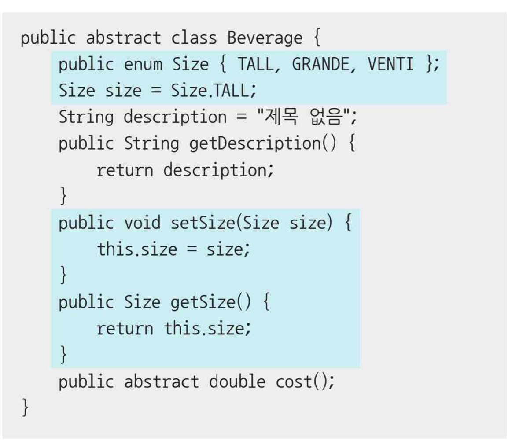

#### 🧠 내 생각
또 다른 데코레이터를 만들자!
