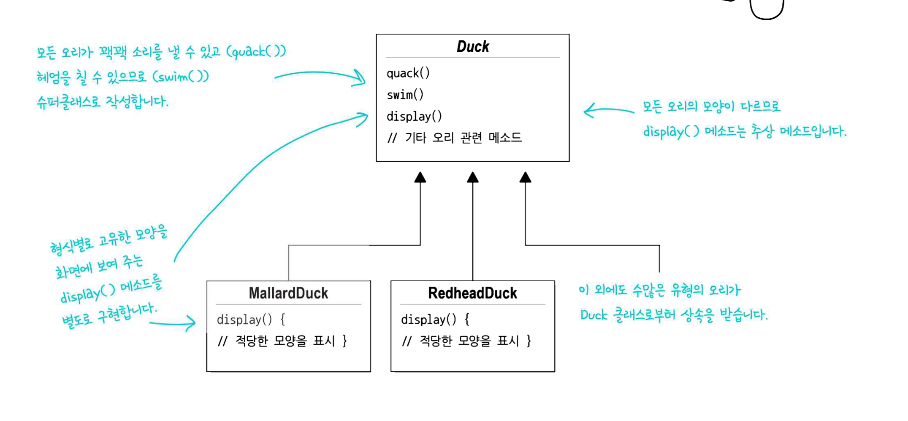
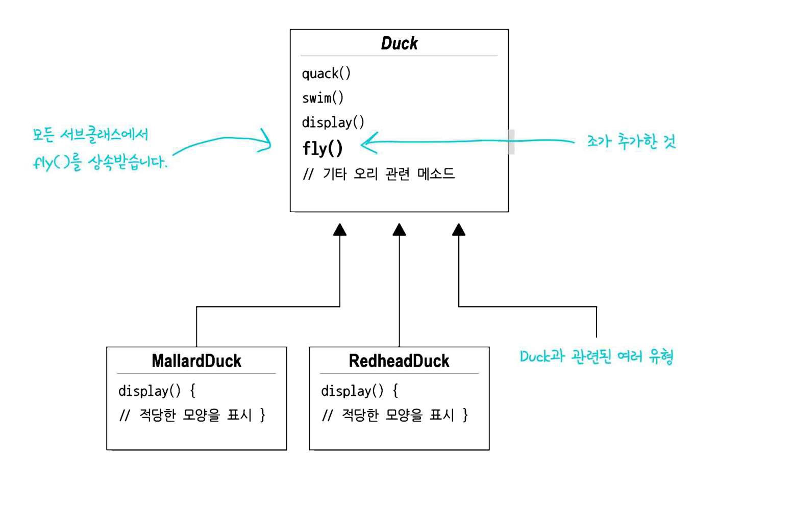

# 시작
## 누군가가 이미 문제를 해결해놓았다
다른 선배 개발자들이 문제를 이미 해결해놓았다.  
우리는 그 지혜와 교훈을 살펴보고, 내 것으로 만들면 된다.  
디자인 패턴은 **코드**가 아니라 **경험**을 재사용하는 것.

## 오리 시뮬레이터

오리 시뮬레이터에는 여러 종류의 오리가 있다.  
- 모든 오리는 소리를 낼 수 있고, 헤엄을 칠 수 있다. (`quack()`, `swim()` 을 슈퍼클래스에 작성)
- 모든 오리는 모양이 다르므로 `display()`는 추상 메소드이며, 별도로 구현한다.

## 차별화하기(변경 사항)
### 문제 1
변경 사항이 생겼다.  
오리를 날아다니게 해야겠다.  
### 해결(?)
슈퍼 클래스에 `fly()`를 추가해서 한 방에 끝냈다.

### 문제 2
일부 오리는 날아다니면 안된다.  
고무 오리는 날아다닐 수 없으며, 삑삑 소리를 내야한다.
나무 오리는 날아다닐 수 없고, 아무 소리도 내지 못한다.

하지만 코드의 일부 변경으로 모든 오리가 날아다니게 되었다.

### 해결(?)

