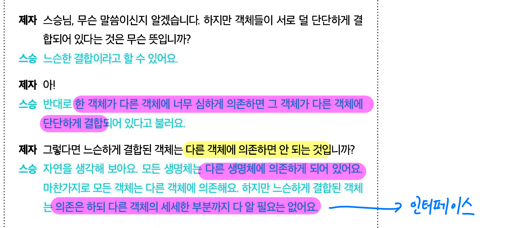

# 옵저버 패턴

## 객체들에게 연락 돌리기

# 기상 모니터링 어플리케이션


`WeatherData` 객체를 사용해 현재 조건, 기상 통계, 기상 예보를 보여주는 어플리케이션을 만들어야 한다.

## `WeatherData` 객체


## 구현 목표

- `WeatherData` 클래스에는 3가지 getter 메소드가 있음
- 기상 측정 데이터가 들어오면 `measurementsChanged()`가 호출됨
- 현재 조건, 기상 통계, 기상 예보 디스플레이를 구현해야 한다.
    - 측정 데이터가 들어올 때 업데이트 되어야 한다.
- `measurementsChanged()`가 디스플레이를 업데이트하도록 해야한다.

## 추가 목표

- 나중에 성공하면 디스플레이가 더 늘어날수도 있고, 디스플레이를 직접 추가하는 마켓플레이스가 생길 수도 있다.
- 따라서 이런 변화에 대비할 수 있도록 **확장성**을 확보해보자

## 1차 시도

```java
public class WeatherData {
	public void measurementsChanged() {
		float temp = getTemperature();
		float humidity = getHumidity();
		float pressure = getPressure();

		currentConditionsDisplay.update(temp, humidity, pressure);
		statisticsDisplay.update(temp, humidity, pressure);
		forecastDisplay.update(temp, humidity, pressure);
	}
}
```


## 문제점


- 구체적인 구현에 맞춰 코딩해서 프로그램을 고쳐야 디스플레이 변경 가능
    - 구체적인 구현이 아니라 인터페이스(상위 형식)에 맞출 필요가 있다.
- Display에 대한 공통 인터페이스를 쓰고있긴 한듯. `update()`
- 실행 중 디스플레이를 더하거나 빼려면?
    - 별도의 디스플레이 배열 객체를 만들어야 할 듯. 그리고 그것을 embed 시켜야 할듯

## 옵저버 패턴

신문자 + 구독자 = 옵저버 패턴

- 신문사 == subject
- 구독자 == observer

### Overview


### 작동 원리

- Duck 객체가 등장해서는 주제에게 자기도 옵저버가 되고 싶다고 이야기 한다.
- Duck 객체가 정식 옵저버가 된다.
- 주제 값이 바뀐다
    - Duck을 비롯한 모든 객체가 주제 값이 바뀌었다는 연락을 받는다.
- Mouse 객체가 옵저버 목록에서 탈퇴하고 싶다고 요청한다.
- 주제가 Mouse 객체를 옵저버 집합에서 제거한다.
- 주제 값이 바뀐다.
    - Mouse는 값이 바뀌었다는 연락을 받지 못한다.

### 정의

> 한 객체의 상태가 바뀌면 그 객체에 의존하는 다른 객체에게 연락이
> 가고 자동으로 내용이 갱신되는 방식으로 일대다 의존성을 정의하는 패턴

### 구조


# 느슨한 결합

## ?

객체들이 상호작용 할 수는 있지만, 서로를 잘 모르는 관계

- 주제(subject)는 옵저버(observer)가 `Observer` 인터페이스를 구현한다는 사실만 알고 있다.
    - 구현체가 무엇인지, 옵저버가 구독한 정보로 무엇을 하는지는 알 필요도 없다.
- 언제든지 새로 추가할 수 있다.
    - Observer 인터페이스만 구현하면 된다.
    - 실행중에도 추가/제거/변경이 자유롭다.
- 독립적이며, 서로 영향을 끼치지 않는다.
    - 마음대로 재사용, 변경 가능

## 의문점



- Q. 느슨한 결합을 가지려면 다른 객체에 의존하면 안된다?
    - A. 의존하게 되어있다. 그러나 세세한 부분까지 알 필요는 없다.

## 디자인 원칙

### 상호작용하는 객체 사이에는 가능하면 느슨한 결합을 사용해야 한다.

> 느슨하게 결합하는 디자인을 사용하면  
> 변경사항이 생겨도 무난히 처리할 수 있는
> 유연한 객체지향 시스템을 구축할 수 있다.  
> 객체 사이 상호의존성을 최소화할 수 있기 때문이다.

# 구현

## 의문점

- Q. 어떻게 디스플레이 구체를 모르고도 데이터를 전달할 수 있을까?
    - A. 인터페이스를 사용하면 조금 나을 것 같다. 공통된 `update()` 메소드가 있으면 될듯
- ⁉️ Q. `update(temp, humid, pressure)`가 정말 괜찮나? 강수량이 추가되면? 체감온도가 추가되면?...?
    - A. 현재 기준(2022/7/24) 내 생각은 DTO 처럼 별도의 객체에 상태를 담아 넘기는 것이 더 좋다고 생각이 든다.
    - DTO를 만드는 것도 캡슐화하면 좋아보인다. `실제 객체.toDTO()` 로 말이지.
    - 아직 답을 찾지는 못했음
    - 책에서는 Push보다는 Pull이 코드를 일반화하고 확장하는 데 좀 더 좋다고 함.
    - 후에 MVC에서 다룬다는데 아직 나오지는 않았음
- ⁉️ Q. [`CurrentConditionDisplay`](example/CurrentConditionDisplay.java)를 만들 때  
`WeatherData`가 아닌 `Subject`를 저장하는 편이 더 좋지 않나?
- A. 나는 일단 그런 것 같은데.
- A. 후에 나올 Push -> Pull 전환을 위한 것이었음.