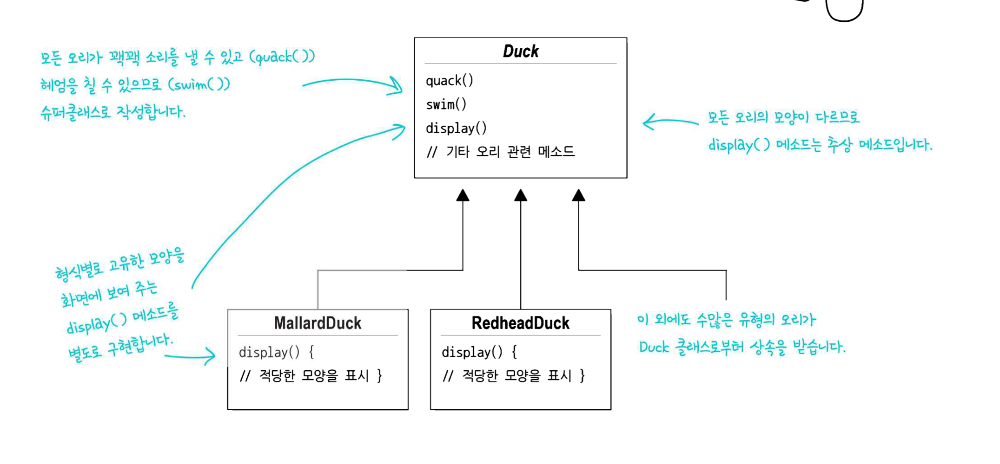
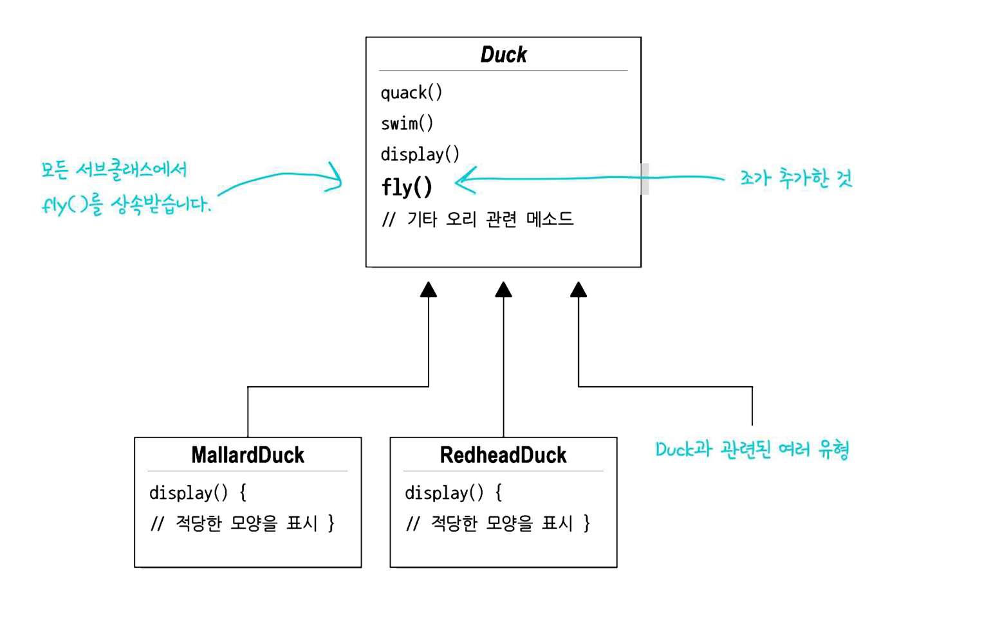
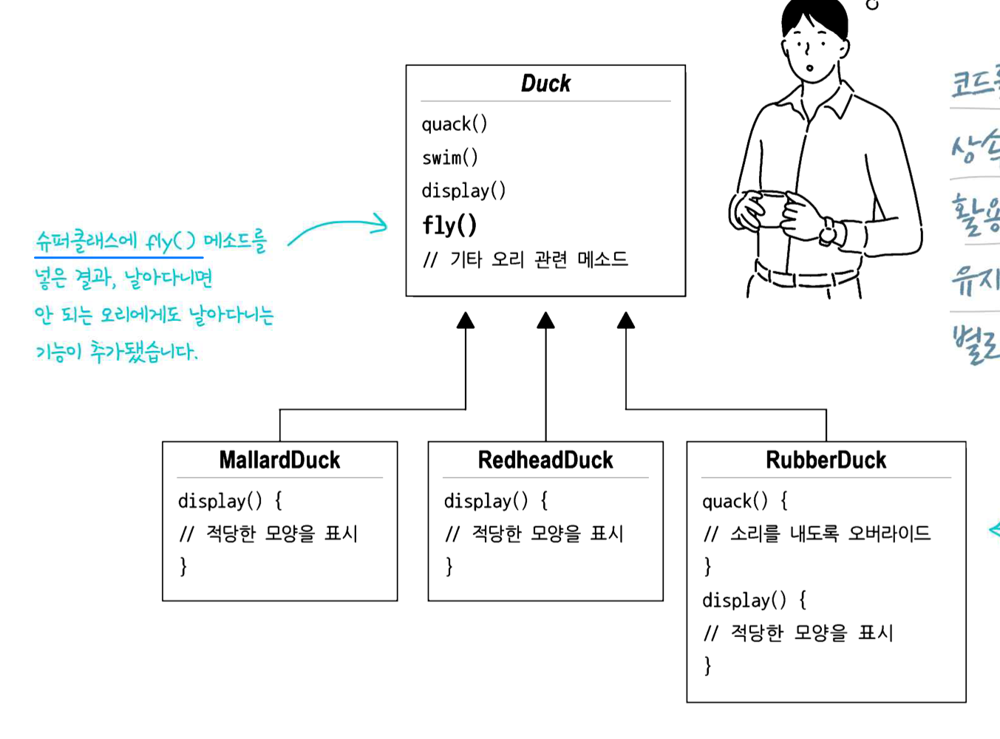
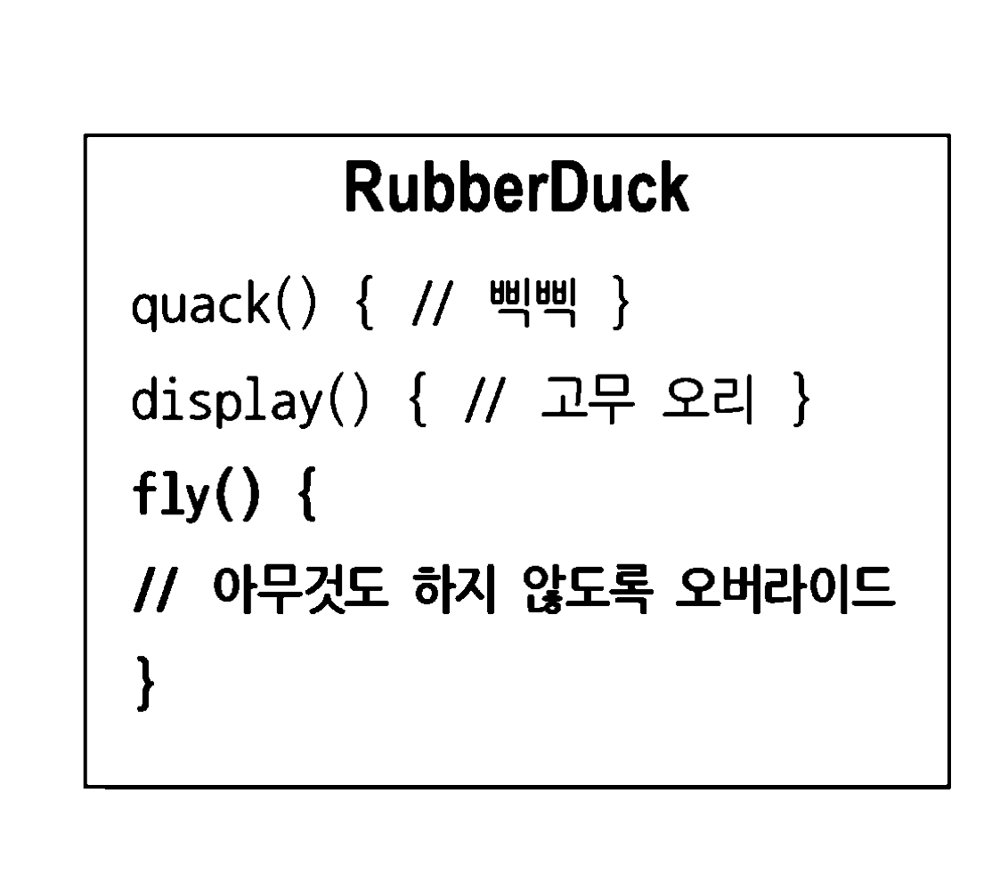
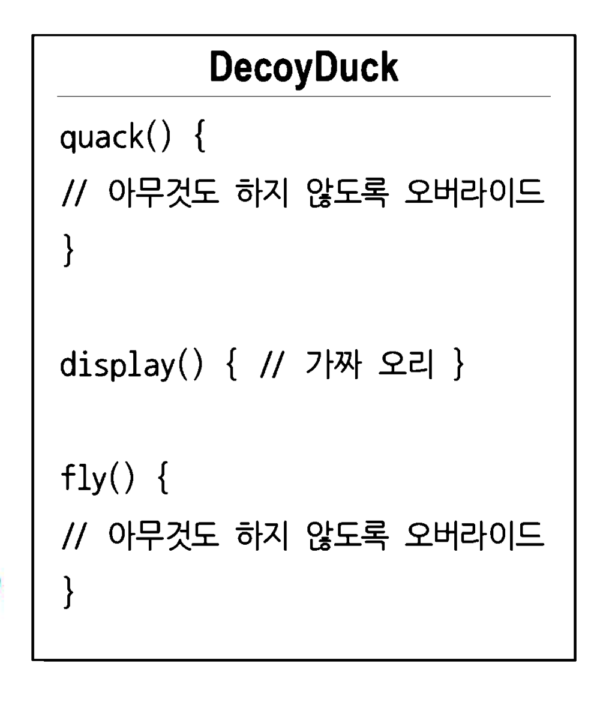
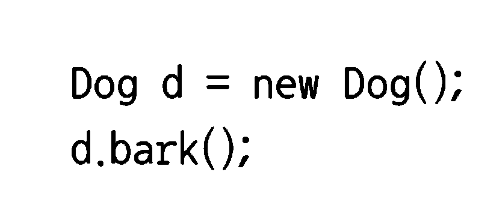
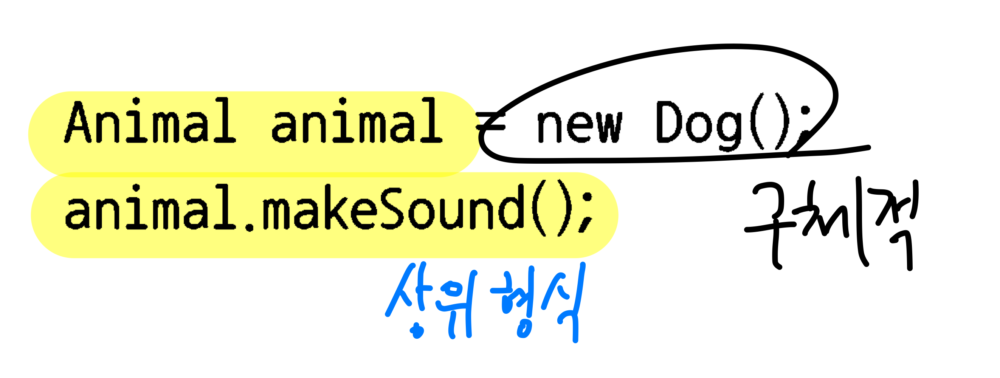
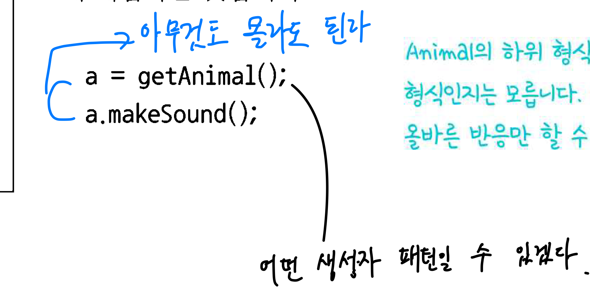
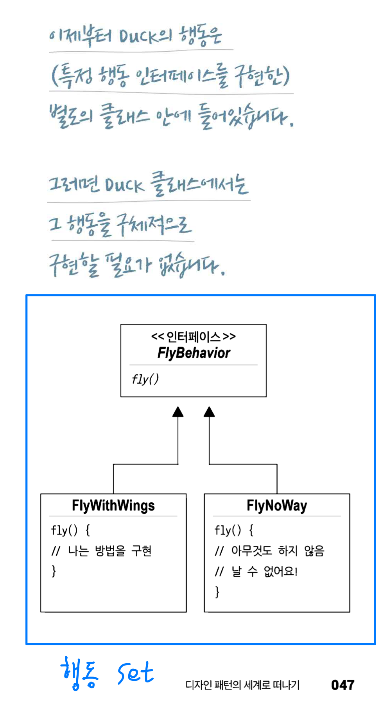
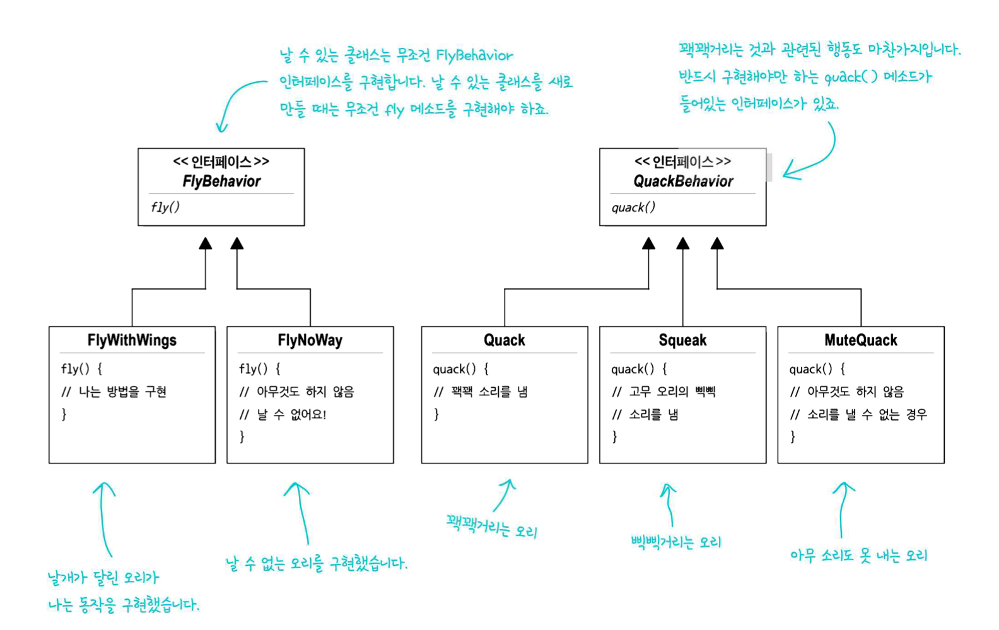

# 시작
## 누군가가 이미 문제를 해결해놓았다
다른 선배 개발자들이 문제를 이미 해결해놓았다.  
우리는 그 지혜와 교훈을 살펴보고, 내 것으로 만들면 된다.  
디자인 패턴은 **코드**가 아니라 **경험**을 재사용하는 것.

## 오리 시뮬레이터

오리 시뮬레이터에는 여러 종류의 오리가 있다.  
- 모든 오리는 소리를 낼 수 있고, 헤엄을 칠 수 있다. (`quack()`, `swim()` 을 슈퍼클래스에 작성)
- 모든 오리는 모양이 다르므로 `display()`는 추상 메소드이며, 별도로 구현한다.

## 변경 사항
### 문제 1
변경 사항이 생겼다.  
오리를 날아다니게 해야겠다.  
### 해결(?)
슈퍼 클래스에 `fly()`를 추가해서 한 방에 끝냈다.

### 문제 2
일부 오리는 날아다니면 안된다.  
고무 오리는 날아다닐 수 없으며, 삑삑 소리를 내야한다.
나무 오리는 날아다닐 수 없고, 아무 소리도 내지 못한다.

하지만 코드의 일부 변경으로 모든 오리가 날아다니게 되었다.

### 해결(?)

#### 삑삑만 다르니 `quack()`을 **오버라이드**하여 해결해볼까?

#### fly()도 **오버라이드** 하면 되잖아!

|  |  |
|---|---|

두 클래스를 만들었다.

### 문제 3
그러나 이것은 적절한 해결 방법이 아니었다.  
앞으로도 변경과 확장이 계속 있을 텐데, 상속을 계속 사용한다면  
1. 수 많은 하위 클래스가 생긴다.
2. 모든 하위클래스들의 오버라이딩을 관리해야 한다.
3. 상위 클래스의 메소드가 바뀌면?
    - 오버라이딩 된 경우 상위 클래스 영향을 받지 않는다.
4. 우는 방법이 바뀌면?
5. fly() 명세가 바뀌면?(모두가 날아야 하는 이벤트 등..)

이제 변경 사항이 생길 때마다 고통받을 것이다.  

### 인터페이스?
인터페이스 `Flyable`, `Quackable`을 만들고, 일부 클래스에서 구현하게 한다?  
`fly()` 이 바뀌면? -> 모든 Duck을 수정해야 한다.  
`quack()` 이 바뀌면? -> 모든 Duck을 수정해야 한다.  

> 중복 코드가 엄청나게 발생하게 된다

모든 메소드를 관리해야 하는 문제가 하나도 해결되지 않았다.  
오히려 전이 나았을지도?

### 소프트웨어의 변화에 기존 코드들이 영향을 덜 받으려면?
디자인을 아무리 잘해도 소프트웨어는 변화한다.  
너무 완벽한 디자인이더라도 시대가 변해서 변할 필요가 있을 수도 있다.  
그래서 디자인을 잘 하는 것도 중요하지만, 변경에 용이하게 만드는 것도 못지않게 중요하다.  

### 정리
위 예제에서 단순 상속(오버라이딩 X)은 문제 해결이 되지 않았다.  
`Flyable`, `Quackable` interface는 코드를 재사용할 수가 없었다.  

## 디자인 원칙
### OCP, Open-Closed Principle
> **달라지는 부분**을 찾아, 나머지 코드에 영향을 주지 않도록 **캡슐화**한다.

즉, 요구사항에 따라 바뀌는 부분이 있다면 분리해야 한다.  
그래야 변경사항에 영향을 받는 부분이 최소화되겠다.  
- 매우 동의하고 마음에 드는 부분이다

### 적용
class `Duck`은 `fly()`와 `quack()` 외에는 잘 작동하고 자주 변하지 않는다.  
- 변화하는 부분: `fly()`, `quack()`
- 변화하지 않는 부분: `display()` 등...

변화하는 부분을 클래스 집합으로 따로 뽑아낸다.

## 디자인 원칙 
### 구현보다는 인터페이스에 맞춰 프로그래밍 한다
> 상위 형식에 맞춰서 프로그래밍하여 다형성을 활용한다.  
-> 즉, 변수를 선언할 때 추상 클래스나 인터페이스 같은 **상위 형식**으로 선언해서   
이를 구현하는 어떤 객체든 넣을 수 있게 한다.  
그러면 실제 객체의 형식을 몰라도 사용할 수 있게 되어 결합도 감소

| 구체적 | 상위형식 | 런타임 생성 |
|-----------------------------|-------|-----|
|  |  |  |

### 적용
그렇다면 `나는 행동`과 `꽥꽥거리는 행동`을 구현하는 클래스 집합은 어떻게 디자인할까?  
- 유연성있게 (애초부터 이 모든 것은 행동의 유연성을 위해서였음)
- `Duck` 인스턴스에 행동(`fly()`, `quack()`) 할당 가능
- 행동을 동적으로 바꿀 수 있다면 더 좋음 -> `setter` 
    - 이 행동은 캡슐화를 깨는 것 아닐까?

각 행동은 인터페이스로 표현, 그 인터페이스를 구현하는 클래스로 실제 행동 구현

이렇게 하면 더 이상 Duck에 국한되지 않는다.

## 구현

이제 다른 형식의 객체(Goose, Pigeon...)에서도 날거나 꽥꽥거리는 행동을 사용할 수도 있다.

> `나는 행동`, `꽥꽥거리는 행동`을 Duck 클래스에서 정의한 메소드를 써서  
> 구현하지 않고 다른 클래스에 위임한다

## 디자인 원칙
### 상속보다는 구성(Composition)을 활용한다.
> "A는 B이다" 보다는 "A에는 B가 있다"가 나을 수 있다.
### 적용
한 오리가 `FlyBehavior`, `QuackBehavior`를 가진다. (구성!, 상속 아님)

# 마무리
이 내용이 전략 패턴(Strategy Pattern)이다.
> Strategy Pattern은 알고리즘군을 정의하고 캡슐화해서 각각의 알고리즘군을 수정해서 쓸 수 있게 해준다.  
> 전략 패턴을 사용하면 클라이언트로부터 알고리즘을 분리해 독립적으로 변경할 수 있다. 👍

재밌당